<h1 align="center">Extra Hand</h1>
<h1 align="center">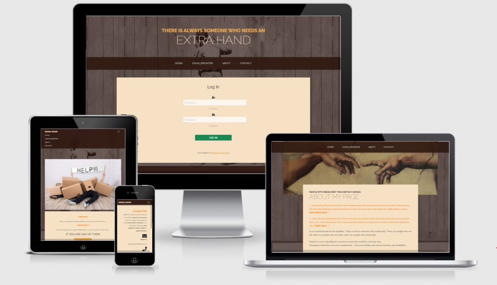</h1>

:point_right: <a href="https://szomoru.github.io/extrahand-mp3/">Live Website</a> :point_left:

:point_right: <a href="https://github.com/szomoru/extrahand-mp3">Github Repository</a> :point_left:
 
 ## About

This website was created to fullfill the requirements of Code Institute 3rd Milstone Project. The main focus of this project is database handling and manipulation through a website. The main goal to maintain a dtabase connected to the website with full CRUD functionality. 
The main purpose of this website to bring together people who needs help and with people who willing to help. This website is based on membership. Registered account required to use the full functionality of the website eg register tasks that we would liket to have someone to help with and also apply to help someone with something. There is no limitation in the audiance, because everyone can be in a situation when needs help. Or is in a situation when can help. 
As a first step this site is created for private persons, but later it is possible to involve professionals and company accounts. 
This site was not built for earning money, but the possibility is given. While it is for private persons, ads placed on the site can genarate some income, later on when companies join the and offer professional solutions some commission can be earned as well. 

## Table of Contents

[User Experience (UX)](#UX)

[Features](#features)

[Technologies Used](#technologies)

[JavaScripts](#scripts)

[Testing](#testing)

[Note about Search Volumes](#searchvolumes)

[Deployment](#deployment)

[Credits](#credits)

## User Experience (UX)

-   ### User stories

    -   #### First Time Visitor Goals

        1. As a First Time Visitor, I want to easily understand the content of the webpage and the aim of the site.
        2. As a First Time Visitor, I want Register for an Account
        3. As a First Time Visitor, I want to be able to easily navigate through the site and get an overal picture about the site structure.
        4. As a First Time Visitor, I want to see their social media availability, where i can get more information about the site or organisation / person behind that.
        5. As a first Time Visitor i want to see clearly what content available for without registration and what requires registration. 

    -   #### Returning Visitor Goals

        1. As a Returning Visitor, I want to be able to login with my previously registered credentials.
        2. As a Returning Visitor, I want to be able to register request for help.
        3. As a Returning Visitor, I want to be able to apply to help someone else.
        4. As a Returning Visitor, I want to be able to update my profile information.
        5. As a Returning Visitor, I want to be able to edit my help request information.
        6. As a Returning Visitor, I want to be able to delete my registered requests.
        7. As a Returning Visitor, I want to be able to browse among all regitered tasks.

    -   #### Admin Goals
        As the admin i want to be able to delete any of the registered tasks.

-   ### Design

    -   #### Colour Scheme
        This website was built on a startbootstrap template, called business-casual (https://startbootstrap.com/theme/business-casual).
        The base of selection of this template is the calm, simple, but professional look of the site. It is stylish but very well represent the serious message of the website. Help eachother ...
        The basic colors follow through the whole website. Some of the basic colors:
        - #f6e1c5 mainly used as a bright background of a section
        - rgba(47, 23, 15, 0.9) mainly used the beckground of the navbar and the footer
        - #e6a756 mainly color of the buttons (which is not submit or cancel)
        - sisimple red and green color used for cancel and submit buttons
        - light grey, light blue and yellow colors are used as information colors these colors comming from bootstrap just like the danger, info, warning bootstrap names

    -   #### Typography
        - The fonts are also comming from the business-casual startbootstrap template (https://startbootstrap.com/theme/business-casual). Me as a developer has not changed it at all, i have not added or removed fonts.
    
    -   #### Imagery
        -   This site at this stage does not use many images. There is one huge image as a background image of the whole site on everypages. This image symbolise the supportive attitude to eachother. there is only one more picture except that on the about page which is just a smaller section of a bigger world famous painting (Michaelangelo - The Creation of Adam).

-   ### Wireframes

    -   There were several design changes during the development process, but the final site looks very similar with the wireframe. The wireframe does not contain any colorscheme, because when it was done it was already known that template will be used, but still was not decided which one. On the following pictures the wireframes are introduced by htmls. Each image contain a desktop, tablet, and phone size wireframe.  

    -   index.html

        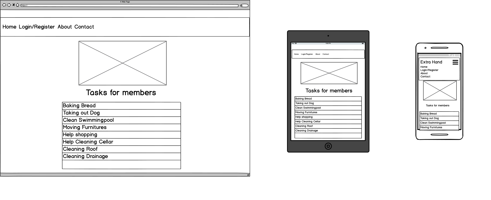

    -   register.html 

        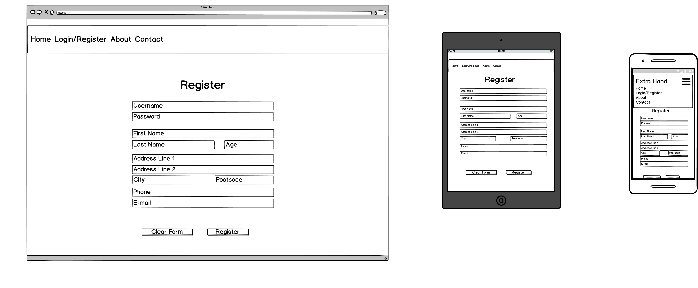

    -   login.html 

        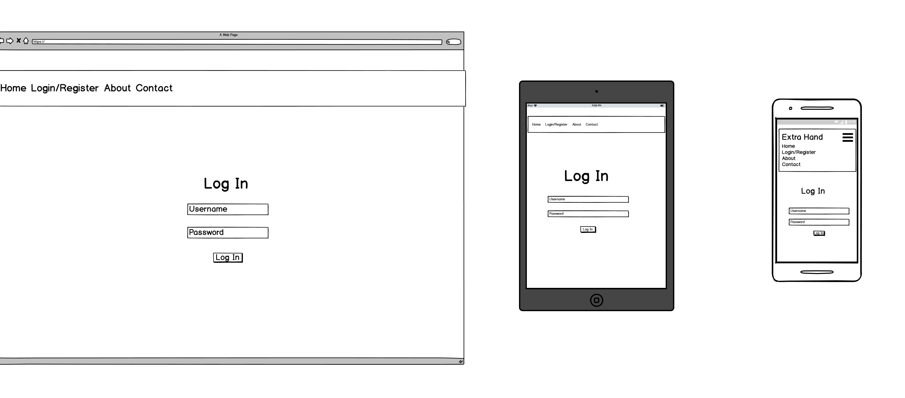

    -   profile.html 

        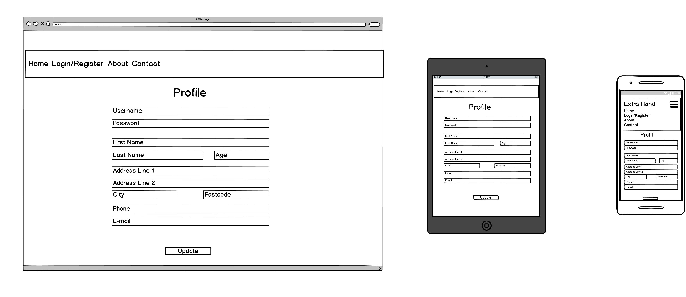

    -   profile_alltask.html 

        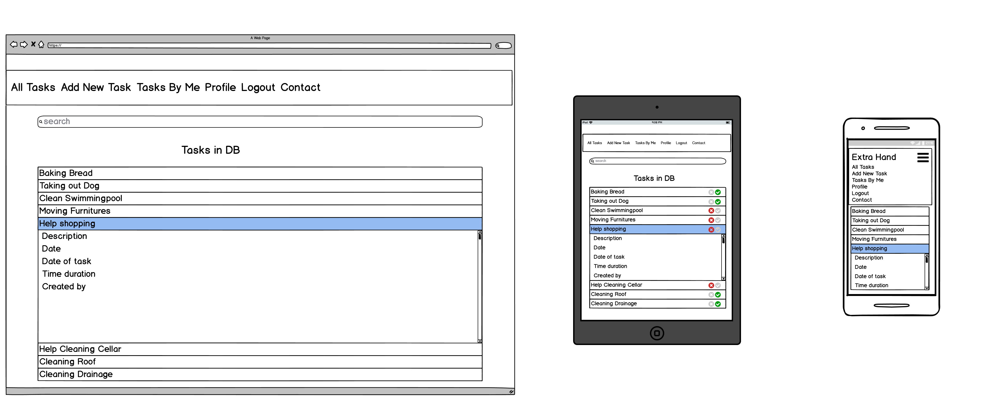

    -   profile_new_task.html 

        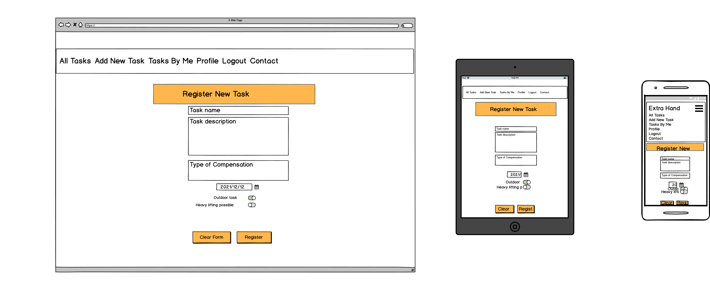

    -   profile_edit_task.html 

        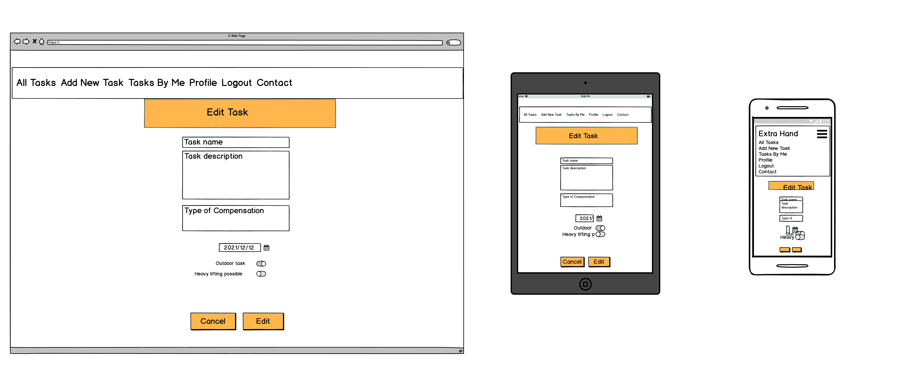

    -   profile_mytasks.html 

        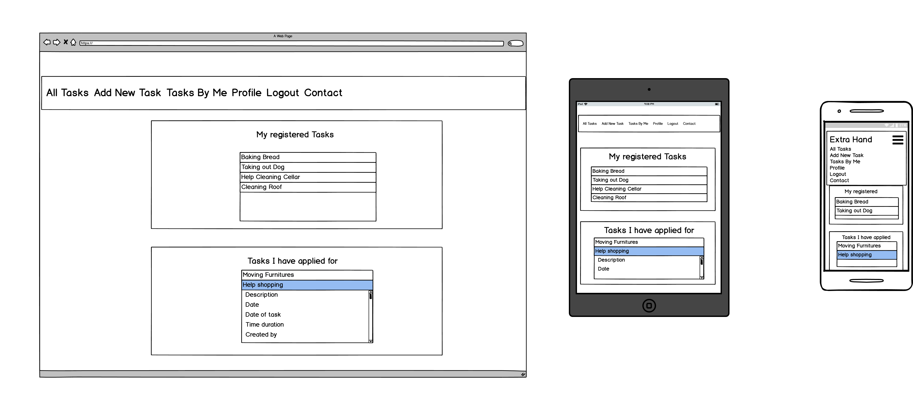

    -   about.html 

        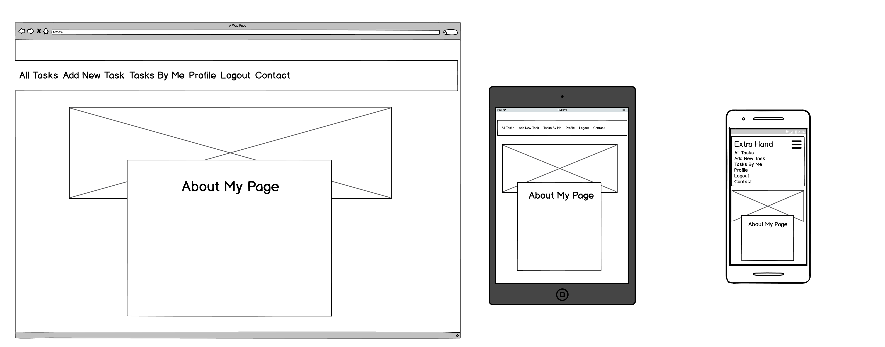

    -   contact.html 

        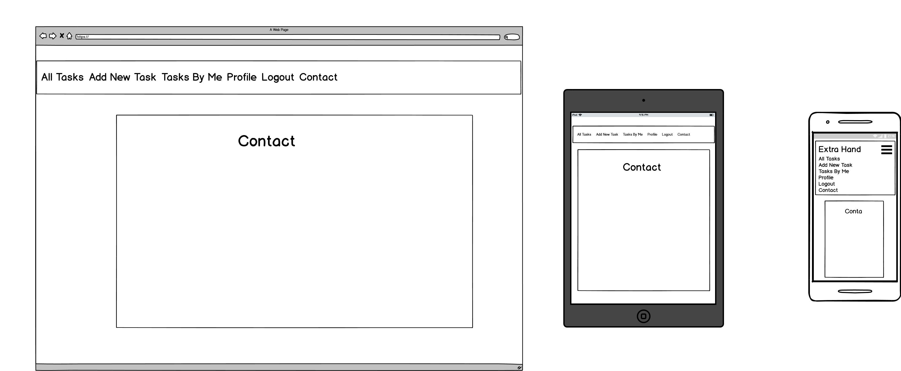

            

    ## Features

    ### Present Features

    #### Features accross all Pages

    -   The website was designed to have the same structure on every pages. On this way the visitor feel comfortable and find her/his way on every page.
        The layout is the following:
        - On the top section there is the Header with Navigation links
        - The middel section is the largest "main" section on every page, which contains the main information. This middel section is also very well separated visually. 
        - The page is closed with the Footer, which in this case contains only a Copyright text and the year. 

    - [x] **Header**
        - The header contains the title of the site (Extra Hand)
        - The second section is the "navigation" section with varried number of menupoints. The NAvigation bar is a sticky navigation, so by scrolling up the page the navigations are always visible. The folowing cases are possible based on authorization:
            -   Basic state no user logged in:
                - Home
                - Login/Register
                - About
                - Contact
            -   User logged in:
                - All Tasks
                - Add New Task
                - Tasks By Me
                - Profile
                - Logout
                - Contact
            -   Admin is logged in:
                - All Tasks
                - Profile
                - Contact

    - [x] **Main section**
        - The main section contains the page specific information on every page.
    - [x] **Footer**
        - Always located as the last element of the page. In this project it does not contain any important information not to steal the focus of the visitor.        

    #### Features specific to Pages

    - [x] **Index page**
        - Hero imnage set to the background, which clearly represents the type of the webpage
        - A smaller window floating over the background, which highlight some topic of the content od the page and call to action
        - If the visitor accept the invitation and take action after clicking the "Learn more" button, gets to the Home page.
    - [x] **Register page**
        - the user can register and get her/his own account to use full potential of the site
    - [x] **Login page**
        - This page is the first page, that is shown after the landing page. By seeing this page the visitor gets a short description about the game itslef.
        - The visitor also can see screenshots from the game, so when she/he starts to play they are already familiar with the layout.
        - As a last element on this page the visitor can click on a button, which takes her/him to the Game page and start the game
    - [x] **About page**
        This page contain some real life cases when the visitor should use this page and a short description about the purpose of the site.
    - [x] **Contact page**
        This is the main page for the visitor if she/he wants to contact to the website developer.
        The visitor can get information about the following:
         - address
         - phone number
         - social media links
         of the developer.
    - [x] **Profile page**
        - This is the first page that the visitor see when she/he successfully identified her-/him-self through a username and password on the login page.
        - This page contains the profile information which was given during the registration process
        - The user has possibility to update this information except the username and password 
    - [x] **Profile all task page**
        - This page has several functions. As a basic the user see all the registered tasks in the database.
        - Through the search function the user can filter up the displayed tasks. The user can search by keywords, which is compared with the Task name and Task description fields.
        - On an individual task, the user can get further information:
            - Orange task header background:
                - The task was registered buy someone else and noone has applied for that yet. 
                - Apply button still active for the user
                - the user cannot edit or delete it
            - Orange task header background with a light blue background text: I HAVE APPLIED:
                - the task was created by someone else and the user applied to help with the task
                - Apply button replaced by the contact info of the task creator
                - user cannot Edit or Delete it
            - Grey task header background with the text of: NOT AVAILABLE FOR YOU:
                - The task has been created by someone else, but it has already been taken by someone else
                - Apply button deactivated for the user
                - the user cannot Edit or Delet it
            - Green task header background
                - the iuser created the task, but noone has applied for it yet
                - the user CAN Edit or Delete it
            - Green task header background with yellow background text HELP SHOWED UP:
                - the user created the task and someone has already applied to help
                - the user can see the volunteer contact information
                - the user CAN Edit or Delete it
        - [x] **Profile New task page**
            - the user can register a new task
        - [x] **Profile Edit task page**
            - the user can edit an already existing task content. The task must be created the user
        - [x] **Profile Apply task page** 
            - the user apply for a task through this page. The user can add further information to the help requier eg. desired contact information
        - [x] **Profile All My Task page**
            - the user can see only the following task in 2 separate sections:
                - the user created help requests
                - the user applications to help
        - [x] **Error handling pages**
            -   404: Page not found
            -   505: Internal server Error
        

    ### Future Features

    There is a lot of potential in this webpage. The focus this time was that the functionalities working properly, so the following features can be added in the future:
    -   Applying more icons and symbols for better UX
    - Automatic e-mail notification to the right persons if the status of one of the task is changed. 
    - Adding a parallel section where professional companies can search for possible clients among the help seekers. 

     

    ## Technologies Used

    ### Languages Used

    - [HTML5](https://developer.mozilla.org/en-US/docs/Web/Guide/HTML/HTML5)
    - [CSS3](https://developer.mozilla.org/en-US/docs/Archive/CSS3#:~:text=CSS3%20is%20the%20latest%20evolution,flexible%20box%20or%20grid%20layouts.)
    - [JavaScript](https://developer.mozilla.org/en-US/docs/Web/JavaScript)
    - [Python](https://www.python.org/)

    ### Workspace

    - [Gitpod](https://gitpod.io/) was used as a virtual IDE workspace to build this site.

    ### Version Control

    - [Git](https://git-scm.com/) was used for version control by utilizing the Gitpod terminal to add and commit to Git and push to GitHub.
    - [GitHub](https://github.com/) is used to store the code for this project after being pushed from Git.

    ### Wireframing

    - [Balsamiq](https://balsamiq.com/) was used to create the wireframes during the design process.

    ### Responsive Design

    - [Am I Responsive Design](http://ami.responsivedesign.is/)

    ### Site Design

    - [Font Awesome](https://fontawesome.com/) was used on all pages to add the icons.
    - [Google Fonts](https://fonts.google.com/) was used to import the _Bangers_ font used within the site.
    - [Favicon.io](https://favicon.io/favicon-generator/)

    ### Database Design Technologies

    - [MongoDB](https://www.mongodb.com/) was used to store the contents of the database, and allow full CRUD functionality.
    - [Flask-PyMongo](https://flask-pymongo.readthedocs.io/en/latest/) was used to connect this Python / Flask app to MongoDB.

    ### Frameworks, Libraries and Others

    - [Heroku](https://www.heroku.com) was used to deploy the live site.
    - [Google DevTools](https://developer.chrome.com/docs/devtools/) was used to check site responsiveness, and as a general debugger.
    - [MaterializeCss](https://www.materializecss.com) was used to design attractive, functional webpage with CSS, Javascript, Html created UI library 
    - [Lighthouse](https://developers.google.com/web/tools/lighthouse/) was used to check the site's Performance, Accessibility, Best Practices, and SEO.
    - [Flask](https://flask.palletsprojects.com/en/2.0.x/) was used to help create the templating for this site.
    - [Bootstrap](https://getbootstrap.com/) was used to create a beautiful, responsive website.
    - [jQuery](https://jquery.com/) was used to make the DOM traversal easier within the JavaScript.
    - [Jinja](https://jinja.palletsprojects.com/en/3.0.x/) was used to auto-populate the site with the contents of the database.
    - [RandomKeygen](https://randomkeygen.com/) was used to generate a strong `SECRET_KEY`.
    - [pip](https://pip.pypa.io/en/stable/) was used to install the required dependancies for this site.
    - [dnspython](https://pypi.org/project/dnspython/) was used to provide access to DNS.
    

    ### Testing

    - [W3C Markup Validation Service](https://validator.w3.org/) was used to test that the HTML is valid.
    - [W3C CSS Validation Service](http://jigsaw.w3.org/css-validator/) was used to test that the CSS is valid.
    - [JSHint](https://jshint.com/) was used to test that the JavaScript is valid.
    - [PEP8](http://pep8online.com/) was used to validate the python syntax.
